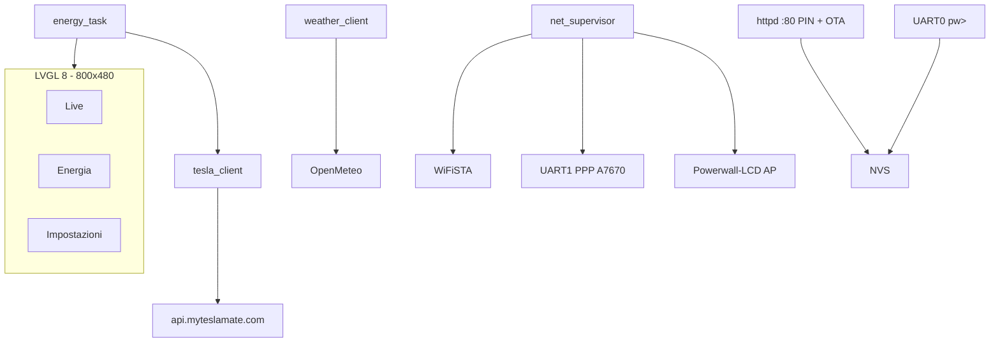

# Tesla Powerwall 3 LCD for teslamate

Firmware **ESP-IDF 5.5** + **LVGL 8** per [Waveshare ESP32-S3-Touch-LCD-7](https://docs.waveshare.com/ESP32-S3-Touch-LCD-7): dashboard touch di un impianto Tesla **Powerwall** (solare, casa, batteria, rete) tramite [MyTeslaMate Fleet API](https://www.myteslamate.com/api/).

Versione attuale: **1.0.1 stable** (`PROJECT_VER` in `CMakeLists.txt`, tag git `v1.0.1`).

## Indice

- [Cosa fa](#cosa-fa)
- [Architettura](#architettura)
- [Hardware](#hardware)
- [4G LTE (A7670X)](#4g-lte-a7670x)
- [Toolchain e flash](#toolchain-e-flash)
- [Primo avvio](#primo-avvio)
- [Configurazione](#configurazione)
- [API Tesla / MyTeslaMate](#api-tesla--myteslamate)
- [UI](#ui)
- [Rete, HTTP e timeout](#rete-http-e-timeout)
- [OTA](#ota)
- [Console seriale](#console-seriale)
- [Struttura del repository](#struttura-del-repository)
- [Licenza e segreti](#licenza-e-segreti)

## Cosa fa

- **Live**: flusso energetico Solare → Casa → Powerwall / Rete, kW, SoC, titolo = `site_name` dell’impianto, meteo Open-Meteo in alto a destra.
- **Energia**: grafici potenza (giorno) e mix “usato da” (oggi).
- **Impostazioni** (PIN `7678`) e wizard al primo avvio: WiFi 2,4 GHz con tastiera, token, host, `energy_site_id`, GPS, APN 4G, intervalli di poll.
- Pagina web sulla LAN (e sull’AP di setup) per lo stesso set di parametri e per l’**OTA**.
- Se non c’è internet: AP **Powerwall-LCD** / password `powerwall` su `http://192.168.4.1/`.
- Persistenza **NVS** (WiFi, token, sito, GPS, APN, poll): niente reflash per cambiare configurazione.
- **4G** opzionale (Waveshare A7670X / A7670E): PPP in fallback se la WiFi STA manca e l’APN è impostato.
- Funzioni spente se manca il dato: niente Tesla senza token, niente meteo senza GPS, niente 4G senza APN.

## Architettura



| Task / modulo | Ruolo |
|---------------|--------|
| `app_main` | Init display RGB + touch GT911, LVGL adapter, NVS, task |
| `net_supervisor` | STA WiFi, fallback LTE, AP di setup, start/stop httpd |
| `energy_task` | Poll `live_status` (default 20 s) e history (~ogni 15 poll) |
| `weather_client` | Open-Meteo, default ogni 15 min |
| `tesla_client` | HTTPS GET, watchdog 12 s, `site_name` da `/products` |
| `app_httpd` | `/` `/pin` `/save` `/wifi` `/ota` `/health` |
| `app_console` | REPL `pw>` su UART0 |
| `app_ota` | Due slot 2,5 MB, versione da `esp_app_desc` |

## Hardware

- **Scheda**: Waveshare ESP32-S3-Touch-LCD-7 (ESP32-S3, PSRAM octal 8 MB, flash 8 MB).
- **Display**: RGB 800×480, 16 bpp, bounce buffer 20 linee; touch **GT911** su I2C (SDA GPIO8, SCL GPIO9); expander CH422G.
- **Flash USB**: Type-C **UART / UART1** (CH343), dip-switch su **UART1**. Il Type-C **USB** è in modalità CAN e **non** programma il chip.
- Console debug: UART0 GPIO43/44, 115200, stesso Type-C UART.
- Schema: [ESP32-S3-Touch-LCD-7-Sch.pdf](https://files.waveshare.net/wiki/ESP32-S3-Touch-LCD-7/ESP32-S3-Touch-LCD-7-Sch.pdf).

Partizioni (`partitions.csv`):

| Nome   | Tipo | Offset   | Size    |
|--------|------|----------|---------|
| nvs    | nvs  | 0x9000   | 24 KB   |
| otadata| ota  | 0xf000   | 8 KB    |
| phy    | phy  | 0x11000  | 4 KB    |
| ota_0  | app  | 0x20000  | 2,5 MB  |
| ota_1  | app  | 0x2A0000 | 2,5 MB  |

## 4G LTE (A7670X)

Istruzioni di cablaggio, alimentazione e APN: **[docs/a7670x-4g.md](docs/a7670x-4g.md)**.

Sintesi: UART TTL 3,3 V **GPIO15 TX → RXD modem**, **GPIO16 RX ← TXD modem**, GND comune. **Non** usare i morsetti RS485 A/B. `VBAT`/5 V del HAT con picchi ~2 A, non dal 3V3 ESP. Il firmware non impulsi PWRKEY: accendi il HAT a mano. Senza APN il 4G non parte.

## Toolchain e flash

Serve **ESP-IDF v5.5.x** (l’adapter LVGL Waveshare richiede IDF ≥ 5.5), target `esp32s3`. Dipendenze in `main/idf_component.yml`: `lvgl` 8.4, `esp_lvgl_adapter`, `esp_lcd_touch_gt911`, `esp_modem`.

```bash
export PATH="/opt/homebrew/bin:/usr/bin:/bin"
. ~/esp/esp-idf/export.sh
cd /path/to/powerwall-lcd
idf.py -p /dev/cu.usbmodemXXXX build flash monitor
```

Uscita dal monitor: `Ctrl+]`.

Su macOS usa `--before default_reset` (default di `idf.py flash`). `--before no_reset` fa fallire il sync: aprire la CDC resetta il chip. Script equivalente: `scripts/flash-download-mode.sh [porta]`.

Se compare `No serial data received`: dip-switch UART1, nessun altro programma sulla porta, ritenta. Schermo nero dopo il flash: tasto **RESET**.

`sdkconfig` è locale (gitignorato); le opzioni di progetto stanno in `sdkconfig.defaults` (PSRAM octal, tabella custom, PPP, bundle CA, `TCP_SYNMAXRTX=3`).

## Primo avvio

1. Se non c’è STA, sul display compare **Powerwall-LCD**. Dal telefono collegati (password `powerwall`) e apri `http://192.168.4.1/`.
2. Scegli una WiFi **2,4 GHz** (l’ESP32-S3 non vede il 5 GHz) e connetti.
3. Dalla LAN: `http://<IP>/` — l’IP è in Impostazioni. Sblocca con PIN **7678**. Incolla il token MyTeslaMate, imposta `energy_site_id` e GPS.
4. In alternativa: wizard sul LCD, oppure console:

```
pw> token <incolla>
pw> site <energy_site_id>
pw> gps 46.1786 13.2005
pw> show
pw> test
```

Il titolo in alto a sinistra sulla Live è il **`site_name`** restituito da Tesla per quell’id (non un nome fisso). Finché l’API non risponde compare `Impianto`.

## Configurazione

Salvata in NVS, namespace `pw`. Campi principali:

| Chiave     | Default | Note |
|------------|---------|------|
| WiFi ssid/pass | vuoto | Solo 2,4 GHz |
| `api_host` | `https://api.myteslamate.com` | Senza slash finale |
| `api_token` | — | Proxy MyTeslaMate, non committare |
| `site_id` | esempio in firmware | Da `/api/1/products` → `energy_site_id` |
| `site_name` | da API | Aggiornato al cambio di `site_id` |
| GPS lat/lon | — | Serve al meteo |
| `lte_apn` / PIN SIM | — | 4G opzionale |
| `poll_s` | 20 | 5–300 s, poll Tesla |
| `wx_poll_min` | 15 | 1–120 min, meteo |

Wizard al boot se mancano WiFi e token.

## API Tesla / MyTeslaMate

Host API: **`https://api.myteslamate.com`** (non `app.myteslamate.com`, che è solo la dashboard). Token Bearer del piano API MyTeslaMate.

Elenco impianti:

```bash
curl -sS \
  -H "Authorization: Bearer IL_TUO_TOKEN" \
  -H "Accept: application/json" \
  "https://api.myteslamate.com/api/1/products" \
| jq '.response[] | select(.energy_site_id != null) | {energy_site_id, site_name, resource_type}'
```

Chiamate usate dal firmware:

| Metodo | Path | Uso |
|--------|------|-----|
| GET | `/api/1/products` | Risolve `site_name` per l’`energy_site_id` configurato |
| GET | `/api/1/energy_sites/{id}/live_status` | kW live + SoC |
| GET | `/api/1/energy_sites/{id}/calendar_history?kind=power&period=day` | Curva odierna |
| GET | `/api/1/energy_sites/{id}/calendar_history?kind=energy&period=day` | kWh / mix |

Meteo: `https://api.open-meteo.com/v1/forecast` (nessuna API key), timezone `auto`.

## UI

Tre tab in basso (Live, Energia, Impostazioni). PIN sulle Impostazioni e sulla pagina web: **7678**.

Live: icone Solare / Casa / Powerwall / Rete, linee di flusso animate sopra soglia 80 W, kW solare e etichetta Casa a **destra** della linea verticale. Meteo: temperatura + icona WMO, forecast 3 giorni × 3 fasce. Log “ultime 15 letture” in Impostazioni.

## Rete, HTTP e timeout

- HTTPS con certificate bundle mbedTLS; `keep-alive` disabilitato.
- Timeout di wall-clock **12 s**: watchdog che fa `shutdown()` sul socket TCP nuovo (non `cancel_request`, che in connect è no-op o riapre il socket).
- SYN TCP: `CONFIG_LWIP_TCP_SYNMAXRTX=3` (evita hang da ~57 s).
- Tesla e meteo HTTPS sono serializzati (`app_net_http_lock`) così il watchdog non chiude il socket sbagliato.
- Un retry dopo 500 ms su errori transienti.

## OTA

Dopo il primo flash USB, aggiornamenti da `http://<IP>/` (PIN): sezione firmware, file `build/powerwall_dashboard.bin`. Riavvio sullo slot nuovo. La pagina mostra `Versione attuale` da `esp_app_desc`.

```bash
. ~/esp/esp-idf/export.sh
idf.py build
# browser: http://<IP>/  →  Carica e riavvia
```

## Console seriale

Prompt `pw>`. Comandi: `show`, `token`, `wifi`, `host`, `site`, `gps`, `apn`, `poll`, `wxpoll`, `test`.

## Struttura del repository

```
CMakeLists.txt          PROJECT_VER, target powerwall_dashboard
sdkconfig.defaults      opzioni IDF committate
partitions.csv          OTA dual slot
main/                   firmware
  app_*.c               rete, config, httpd, OTA, LTE, console
  tesla_client.c        MyTeslaMate
  weather_client.c      Open-Meteo
  energy_model.c        stato condiviso UI
  ui/                   LVGL
  bsp/                  port Waveshare RGB + GT911
docs/a7670x-4g.md       cablaggio 4G
scripts/flash-download-mode.sh
```

## Licenza e segreti

Il **token MyTeslaMate**, password WiFi e PIN SIM non vanno nel git (restano in NVS sul dispositivo). `sdkconfig` locale è in `.gitignore`.
