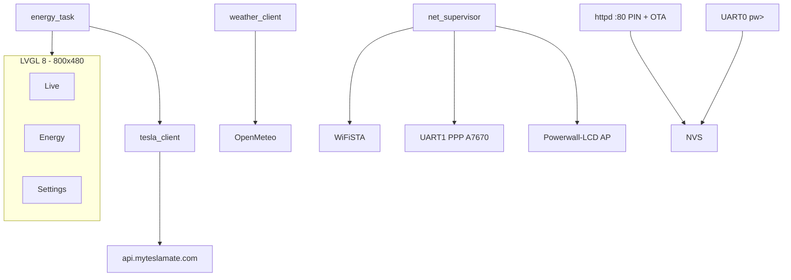

# Tesla Powerwall 3 LCD for teslamate

ESP-IDF **5.5** + **LVGL 8** firmware for the [Waveshare ESP32-S3-Touch-LCD-7](https://docs.waveshare.com/ESP32-S3-Touch-LCD-7): a touch dashboard for a Tesla **Powerwall** site (solar, home, battery, grid) using the [MyTeslaMate Fleet API](https://www.myteslamate.com/api/).

Current version: **1.0.1 stable** (`PROJECT_VER` in `CMakeLists.txt`, git tag `v1.0.1`).

## Contents

- [What it does](#what-it-does)
- [Architecture](#architecture)
- [Hardware](#hardware)
- [4G LTE (A7670X)](#4g-lte-a7670x)
- [Toolchain and flash](#toolchain-and-flash)
- [First boot](#first-boot)
- [Configuration](#configuration)
- [Tesla / MyTeslaMate API](#tesla--myteslamate-api)
- [UI](#ui)
- [Networking, HTTP, and timeouts](#networking-http-and-timeouts)
- [OTA](#ota)
- [Serial console](#serial-console)
- [Repository layout](#repository-layout)
- [Secrets](#secrets)

## What it does

- **Live**: energy flow Solar → Home → Powerwall / Grid, kW, SoC, title = site `site_name`, Open-Meteo weather in the top-right.
- **Energy**: daily power chart and “used by” mix (today).
- **Settings** (PIN `7678`) and first-boot wizard: 2.4 GHz WiFi with on-screen keyboard, token, host, `energy_site_id`, GPS, 4G APN, poll intervals, **language (Italian / English)**.
- LAN web page (and the setup AP) for the same settings plus **OTA**.
- If there is no internet: AP **Powerwall-LCD** / password `powerwall` at `http://192.168.4.1/`.
- **NVS** persistence (WiFi, token, site, GPS, APN, poll, language): no reflash to change config.
- Optional **4G** (Waveshare A7670X / A7670E): PPP fallback when WiFi STA is down and an APN is set.
- Features stay off until their data is set: no Tesla without a token, no weather without GPS, no 4G without an APN.

## Architecture



| Task / module | Role |
|---------------|------|
| `app_main` | RGB display + GT911 touch, LVGL adapter, NVS, tasks |
| `net_supervisor` | WiFi STA, LTE fallback, setup AP, httpd start/stop |
| `energy_task` | Poll `live_status` (default 20 s) and history (~every 15 polls) |
| `weather_client` | Open-Meteo, default every 15 min |
| `tesla_client` | HTTPS GET, 12 s watchdog, `site_name` from `/products` |
| `app_httpd` | `/` `/pin` `/save` `/wifi` `/ota` `/health` |
| `app_console` | `pw>` REPL on UART0 |
| `app_ota` | Dual 2.5 MB slots, version from `esp_app_desc` |

## Hardware

- **Board**: Waveshare ESP32-S3-Touch-LCD-7 (ESP32-S3, 8 MB octal PSRAM, 8 MB flash).
- **Display**: RGB 800×480, 16 bpp, 20-line bounce buffer; **GT911** touch on I2C (SDA GPIO8, SCL GPIO9); CH422G expander.
- **USB flash**: Type-C **UART / UART1** (CH343), dip-switch on **UART1**. Type-C **USB** is CAN mode and **does not** program the chip.
- Debug console: UART0 GPIO43/44, 115200, same UART Type-C.
- Schematic: [ESP32-S3-Touch-LCD-7-Sch.pdf](https://files.waveshare.net/wiki/ESP32-S3-Touch-LCD-7/ESP32-S3-Touch-LCD-7-Sch.pdf).

Partitions (`partitions.csv`):

| Name    | Type | Offset   | Size   |
|---------|------|----------|--------|
| nvs     | nvs  | 0x9000   | 24 KB  |
| otadata | ota  | 0xf000   | 8 KB   |
| phy     | phy  | 0x11000  | 4 KB   |
| ota_0   | app  | 0x20000  | 2.5 MB |
| ota_1   | app  | 0x2A0000 | 2.5 MB |

## 4G LTE (A7670X)

Wiring, power, and APN: **[docs/a7670x-4g.md](docs/a7670x-4g.md)**.

Summary: 3.3 V TTL UART **GPIO15 TX → modem RXD**, **GPIO16 RX ← modem TXD**, common GND. **Do not** use the RS485 A/B terminals. HAT `VBAT`/5 V must handle ~2 A peaks — not the ESP 3.3 V rail. Firmware does not pulse PWRKEY: power the HAT yourself. Without an APN, 4G is never started.

## Toolchain and flash

**ESP-IDF v5.5.x** (the Waveshare LVGL adapter needs IDF ≥ 5.5), target `esp32s3`. Dependencies in `main/idf_component.yml`: `lvgl` 8.4, `esp_lvgl_adapter`, `esp_lcd_touch_gt911`, `esp_modem`.

```bash
export PATH="/opt/homebrew/bin:/usr/bin:/bin"
. ~/esp/esp-idf/export.sh
cd /path/to/powerwall-lcd
idf.py -p /dev/cu.usbmodemXXXX build flash monitor
```

Leave the monitor with `Ctrl+]`.

On macOS use `--before default_reset` (idf.py flash default). `--before no_reset` fails sync because opening the CDC port resets the chip. Equivalent script: `scripts/flash-download-mode.sh [port]`.

If you see `No serial data received`: UART1 dip-switch, nothing else on the port, retry. Black screen after flash: press **RESET**.

`sdkconfig` is local (gitignored). Committed options live in `sdkconfig.defaults` (octal PSRAM, custom table, PPP, CA bundle, `TCP_SYNMAXRTX=3`).

## First boot

1. If STA is down, the display shows **Powerwall-LCD**. Join from a phone (password `powerwall`) and open `http://192.168.4.1/`.
2. Pick a **2.4 GHz** WiFi network (ESP32-S3 cannot see 5 GHz) and connect.
3. On the LAN: `http://<IP>/` — IP is on Settings. Unlock with PIN **7678**. Paste the MyTeslaMate token, set `energy_site_id` and GPS.
4. Or use the LCD wizard, or the serial console:

```
pw> token <paste>
pw> site <energy_site_id>
pw> gps 46.1786 13.2005
pw> show
pw> test
```

The Live title (top-left) is Tesla’s **`site_name`** for that id. Until the API returns it, the label is **Site** / **Impianto**.

## Configuration

Stored in NVS namespace `pw`:

| Key | Default | Notes |
|-----|---------|--------|
| WiFi ssid/pass | empty | 2.4 GHz only |
| `api_host` | `https://api.myteslamate.com` | No trailing slash |
| `api_token` | — | MyTeslaMate proxy; do not commit |
| `site_id` | firmware example | From `/api/1/products` → `energy_site_id` |
| `site_name` | from API | Refreshed when `site_id` changes |
| GPS lat/lon | — | Required for weather |
| `lte_apn` / SIM PIN | — | Optional 4G |
| `poll_s` | 20 | 5–300 s Tesla poll |
| `wx_poll_min` | 15 | 1–120 min weather |
| `lang` | Italian | `0` = Italian, `1` = English |

Wizard at boot if both WiFi and LTE APN are missing.

## Tesla / MyTeslaMate API

API host: **`https://api.myteslamate.com`** (not `app.myteslamate.com`, which is the dashboard). Bearer token from the MyTeslaMate API plan.

List energy sites:

```bash
curl -sS \
  -H "Authorization: Bearer YOUR_TOKEN" \
  -H "Accept: application/json" \
  "https://api.myteslamate.com/api/1/products" \
| jq '.response[] | select(.energy_site_id != null) | {energy_site_id, site_name, resource_type}'
```

Firmware calls:

| Method | Path | Use |
|--------|------|-----|
| GET | `/api/1/products` | Resolve `site_name` for the configured `energy_site_id` |
| GET | `/api/1/energy_sites/{id}/live_status` | Live kW + SoC |
| GET | `/api/1/energy_sites/{id}/calendar_history?kind=power&period=day` | Today’s power curve |
| GET | `/api/1/energy_sites/{id}/calendar_history?kind=energy&period=day` | kWh / mix |

Weather: `https://api.open-meteo.com/v1/forecast` (no API key), `timezone=auto`.

## UI

Three bottom tabs (Live, Energy, Settings). PIN on Settings and the web page: **7678**. Language is Italian or English (Settings, persisted in NVS).

Live: Solar / Home / Powerwall / Grid icons, animated flow above 80 W, solar kW and Home label to the **right** of the vertical line. Weather: temperature + WMO icon, 3-day × 3-slot forecast. Last 15 readings in Settings.

## Networking, HTTP, and timeouts

- HTTPS with the mbedTLS certificate bundle; keep-alive disabled.
- **12 s** wall-clock watchdog: `shutdown()` on the GET’s new TCP socket (`cancel_request` is a no-op or reconnects during connect).
- TCP SYN: `CONFIG_LWIP_TCP_SYNMAXRTX=3` (avoids ~57 s hangs).
- Tesla and weather HTTPS are serialized (`app_net_http_lock`) so the watchdog cannot close the wrong socket.
- One retry after 500 ms on transient errors.

## OTA

After the first USB flash, update from `http://<IP>/` (PIN): firmware section, file `build/powerwall_dashboard.bin`. Reboot onto the new slot. The page shows current version from `esp_app_desc`.

```bash
. ~/esp/esp-idf/export.sh
idf.py build
# browser: http://<IP>/  →  Upload and reboot
```

## Serial console

Prompt `pw>`. Commands: `show`, `token`, `wifi`, `host`, `site`, `gps`, `apn`, `poll`, `wxpoll`, `test`.

## Repository layout

```
CMakeLists.txt          PROJECT_VER, target powerwall_dashboard
sdkconfig.defaults      committed IDF options
partitions.csv          dual OTA slots
main/                   firmware
  app_*.c               net, config, httpd, OTA, LTE, console, i18n
  tesla_client.c        MyTeslaMate
  weather_client.c      Open-Meteo
  energy_model.c        UI shared state
  ui/                   LVGL
  bsp/                  Waveshare RGB + GT911 port
docs/a7670x-4g.md       4G wiring
scripts/flash-download-mode.sh
```

## Secrets

Do not commit the **MyTeslaMate token**, WiFi password, or SIM PIN (they live in NVS on the device). Local `sdkconfig` is gitignored.
